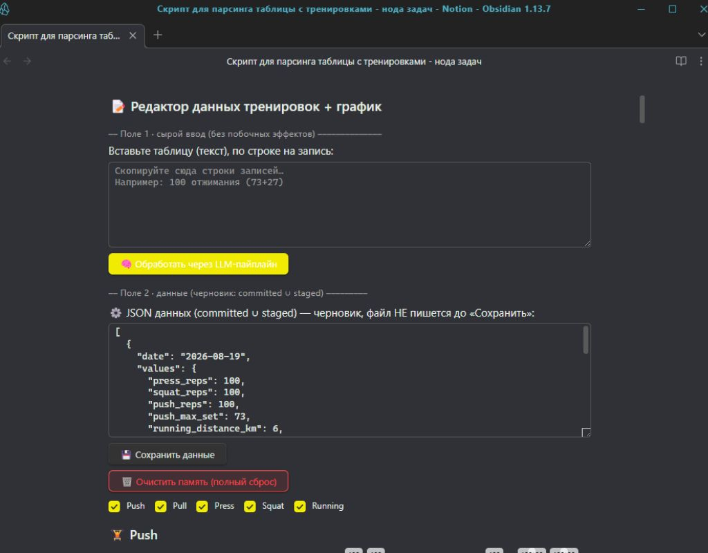
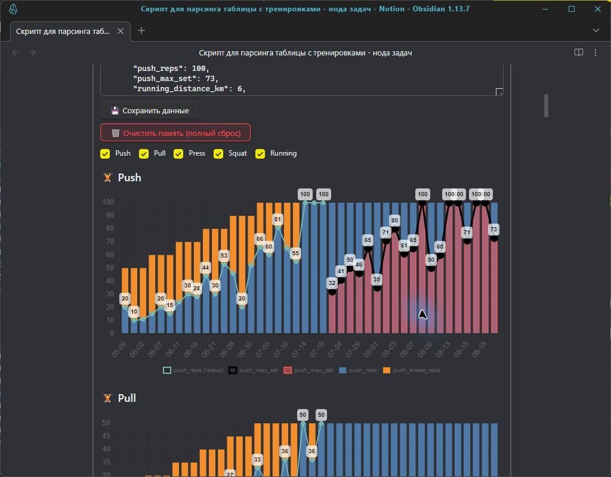

# Semantic Training Interpreter

Виджет для [Obsidian](https://obsidian.md/download), который превращает записи о тренировках в структурированные данные и сразу показывает графики внутри заметки. Записи обрабатывает локальная языковая модель через [Ollama](https://ollama.com/download). Черновик хранится отдельно; постоянные данные и правила записываются в Vault только после явного сохранения.



## Зачем я это сделал

Мне хотелось видеть прогресс тренировок на красивом графике и самому определять, как должны отображаться упражнения и их части. Первые идеи и решения на Python требовали отдельного рендеринга: после изменения данных приходилось снова строить картинку и возвращаться к ней из заметок.

Этот проект — эксперимент с локальной LLM. Вместо жёсткого формата записи можно вставить текст тренировки, получить JSON и предложенные правила, проверить результат, а затем сохранить его. График появляется прямо в Obsidian после обработки: отдельный Python-рендер не нужен.

## Как это работает

1. Вставьте запись или таблицу тренировок в первое поле и нажмите **«Обработать через LLM-пайплайн»**.
2. Локальная модель распознаёт даты, упражнения и значения, предлагает JSON и при необходимости дополнение правил.
3. Второе поле и график показывают предварительный результат. Его можно проверить до сохранения.
4. Кнопка **«Сохранить данные»** записывает подтверждённые события, правила и связи графа. При повторном открытии заметки видны сохранённые данные; незавершённый черновик восстанавливается из временных файлов.

Правила фиксируют смысл метрик, а граф — связи между ними: например, части упражнения можно показать составными столбцами, а максимум за подход — отдельной линией. Набор упражнений не зашит в README: каждый пользователь начинает со своего пустого состояния и постепенно создаёт собственные данные и правила.



## Что понадобится

- **Obsidian для компьютера** и установленный в нём плагин [Dataview](https://community.obsidian.md/plugins/dataview). В настройках Dataview должны быть разрешены **JavaScript Queries**: виджет запускается как `dataviewjs` и использует [`dv.view()`](https://blacksmithgu.github.io/obsidian-dataview/api/code-reference/).
- **[Ollama](https://ollama.com/download)** с локальной моделью [`gemma4`](https://ollama.com/library/gemma4). На ней подготовлены текущие промпты; по умолчанию код обращается к `http://localhost:11434/api/chat` и запрашивает модель `gemma4`. Другие модели могут отвечать иначе.
- Доступ к сети для загрузки **Chart.js** и `chartjs-plugin-datalabels`: текущая версия загружает их с jsDelivr при открытии графика. Отдельный плагин Charts для Obsidian не нужен.
- **Node.js** нужен только для пересборки `bundle.js` и запуска тестов при разработке. Готовый `bundle.js` уже лежит в репозитории; Python для работы виджета не нужен.

## Установка

1. Установите Obsidian. В **Настройки → Сторонние плагины** найдите и включите Dataview, затем разрешите в его настройках выполнение JavaScript-запросов.
2. Установите и запустите Ollama. Скачайте модель:

   ```sh
   ollama pull gemma4
   ollama list
   ```

   Убедитесь, что локальный сервер Ollama работает. На Windows приложение Ollama обычно запускает его в фоне; на Linux при необходимости запустите `ollama serve`. Приложение ожидает сервер на `localhost:11434`.
3. Скопируйте этот репозиторий **внутрь вашего Vault** строго по пути `scripts/training` от его корня. Проверьте, что существуют `<Vault>/scripts/training/main.js` и `<Vault>/scripts/training/bundle.js`. Сейчас пути внутри виджета рассчитаны именно на такое расположение.
4. Создайте заметку в Obsidian и добавьте блок:

   ```dataviewjs
   await dv.view("scripts/training/main", {});
   ```

5. Откройте заметку в режиме чтения или Live Preview. Должны появиться поле ввода, JSON и область графика. Вставьте свои записи, обработайте их и сохраните результат после проверки.

Если вы меняли файлы в `core/`, `adapters/`, `ui/` или `prompts/`, пересоберите `bundle.js` из папки `scripts/training` и переоткройте заметку:

```sh
npm run build
```

## Где хранятся данные

Рабочие записи принадлежат вашему Vault. События сохраняются в `<Vault>/data/training/data.json`, правила — в `<Vault>/scripts/training/data/rulesLog.json`, связи графа — в `<Vault>/scripts/training/data/graph.json`. Временные файлы сохраняют черновик до подтверждения. Личные данные, правила, граф и резервные копии исключены из Git; тестовые примеры в `docs/testing/` остаются в репозитории только для проверки общей логики.

## Разработка и текущие ограничения

Проект пока экспериментальный. Модель может ошибиться в разборе записи или предложить неудачное правило: проверяйте JSON и график перед **«Сохранить данные»**. Обработка зависит от скорости локальной модели; график после неё строится в самой заметке Obsidian. Работа без сети для графиков пока не гарантирована из-за загрузки Chart.js с CDN. Проверялась настольная версия Obsidian; отдельная проверка мобильной установки не проводилась.

Для разработки понадобится Node.js с npm (локальные проверки выполнялись на Node.js 24). Из папки проекта:

```sh
npm test
npm run build
```

Промпты и визуализация находятся в `prompts/` и `ui/`; более подробный план проверки — в [протоколе тестирования](docs/testing/TESTING_PROTOCOL.md). Личные правила из чужого Vault не нужны для запуска: новый пользователь создаёт свои через тот же процесс обработки и сохранения.
